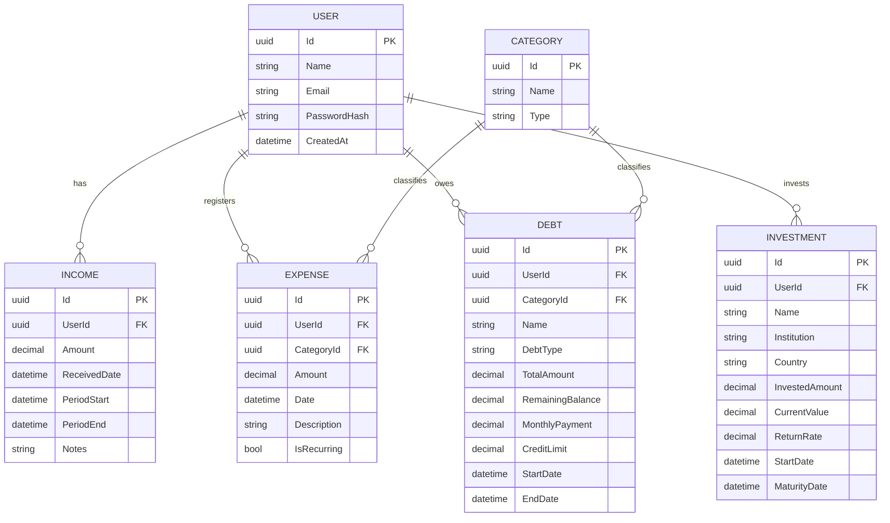

# FinanzApp — Personal Finance Control API

Backend API for personal finance management built with **Clean Architecture** and **.NET 9**.

Designed to answer the key questions every person needs about their finances:

- How much do I owe in total?
- Which expenses can I reduce?
- Which credit card should I stop using?
- How many payments are left to pay off a debt?
- How much do I have available this pay period?

---

## Architecture



### Solution structure

```
FinanzApp/
├── src/
│   ├── FinanzApp.Domain/          # Entities, enums — no external dependencies
│   ├── FinanzApp.Application/     # DTOs, interfaces, services, business logic
│   ├── FinanzApp.Infrastructure/  # EF Core, repositories, JWT, password hashing
│   └── FinanzApp.API/             # Controllers, Program.cs, Swagger
└── tests/
    └── FinanzApp.Tests/
```

### Dependency rule

```
API → Application → Domain
Infrastructure → Application → Domain
```

> Domain has zero external dependencies. It does not know EF Core, HTTP, or any framework exists.

---

## Tech stack

| Layer            | Technology               |
| ---------------- | ------------------------ |
| Framework        | .NET 9 / ASP.NET Core    |
| ORM              | Entity Framework Core 9  |
| Database         | SQL Server 2022 (Docker) |
| Mapping          | Mapster 10               |
| Auth             | JWT Bearer               |
| Password hashing | BCrypt.Net               |
| API docs         | Swagger / Swashbuckle    |

---

## Run locally

### Prerequisites

- .NET 9 SDK
- Docker Desktop

### 1. Start SQL Server container

```bash
docker run -e "ACCEPT_EULA=Y" -e "SA_PASSWORD=FinanzApp123!" \
  -p 1433:1433 --name finanzapp-sql \
  -d mcr.microsoft.com/mssql/server:2022-latest
```

### 2. Clone and restore

```bash
git clone https://github.com/your-username/FinanzApp.git
cd FinanzApp
dotnet restore
```

### 3. Apply migrations

```bash
dotnet ef database update \
  --project src/FinanzApp.Infrastructure \
  --startup-project src/FinanzApp.API
```

### 4. Run

```bash
dotnet run --project src/FinanzApp.API
```

### 5. Open Swagger

```
https://localhost:{port}/swagger
```

---

## API Endpoints

### Auth

| Method | Endpoint             | Description             |
| ------ | -------------------- | ----------------------- |
| POST   | `/api/auth/register` | Register new user       |
| POST   | `/api/auth/login`    | Login and get JWT token |

### Incomes

| Method | Endpoint            | Description                            |
| ------ | ------------------- | -------------------------------------- |
| GET    | `/api/incomes`      | Get all incomes for authenticated user |
| GET    | `/api/incomes/{id}` | Get income by id                       |
| POST   | `/api/incomes`      | Register new income                    |
| PUT    | `/api/incomes/{id}` | Update income                          |
| DELETE | `/api/incomes/{id}` | Delete income                          |

### Expenses

| Method | Endpoint             | Description          |
| ------ | -------------------- | -------------------- |
| GET    | `/api/expenses`      | Get all expenses     |
| GET    | `/api/expenses/{id}` | Get expense by id    |
| POST   | `/api/expenses`      | Register new expense |
| PUT    | `/api/expenses/{id}` | Update expense       |
| DELETE | `/api/expenses/{id}` | Delete expense       |

### Debts

| Method | Endpoint          | Description       |
| ------ | ----------------- | ----------------- |
| GET    | `/api/debts`      | Get all debts     |
| GET    | `/api/debts/{id}` | Get debt by id    |
| POST   | `/api/debts`      | Register new debt |
| PUT    | `/api/debts/{id}` | Update debt       |
| DELETE | `/api/debts/{id}` | Delete debt       |

### Investments

| Method | Endpoint                | Description             |
| ------ | ----------------------- | ----------------------- |
| GET    | `/api/investments`      | Get all investments     |
| GET    | `/api/investments/{id}` | Get investment by id    |
| POST   | `/api/investments`      | Register new investment |
| PUT    | `/api/investments/{id}` | Update investment       |
| DELETE | `/api/investments/{id}` | Delete investment       |

### Categories

| Method | Endpoint               | Description        |
| ------ | ---------------------- | ------------------ |
| GET    | `/api/categories`      | Get all categories |
| GET    | `/api/categories/{id}` | Get category by id |
| POST   | `/api/categories`      | Create category    |

### Dashboard

| Method | Endpoint                           | Description                                        |
| ------ | ---------------------------------- | -------------------------------------------------- |
| GET    | `/api/dashboard/summary`           | Financial summary for current pay period           |
| GET    | `/api/dashboard/debts-overview`    | Total debt, monthly payments, cards to avoid       |
| GET    | `/api/dashboard/expense-analysis`  | Expenses by category, recurring expenses           |
| GET    | `/api/dashboard/available-balance` | Available balance after expenses and debt payments |

---

## Architecture decisions

**Why Clean Architecture?**
Separation of concerns across 4 layers ensures the business logic (Domain + Application) has zero dependency on frameworks, databases, or HTTP. Swapping SQL Server for PostgreSQL or REST for gRPC would only affect Infrastructure and API layers respectively.

**Why Mapster over AutoMapper?**
AutoMapper versions 12 and 13 both carry known high-severity vulnerabilities as of May 2026. Mapster provides equivalent functionality with better performance and no known vulnerabilities.

**Why a single Debt entity for loans and credit cards?**
Both share core financial properties. Differences (credit limit, cutoff date) are handled with nullable fields and a `DebtType` discriminator enum. Separating into two tables would add complexity without meaningful benefit at this scope.

**Why JWT stored in appsettings.json?**
Development only. Production deployment would use Azure Key Vault or environment variables — never hardcoded secrets in source control.

---

## Roadmap

- [ ] FluentValidation on all input DTOs
- [ ] Global exception handling middleware
- [ ] Unit tests for DashboardService
- [ ] Azure deployment
